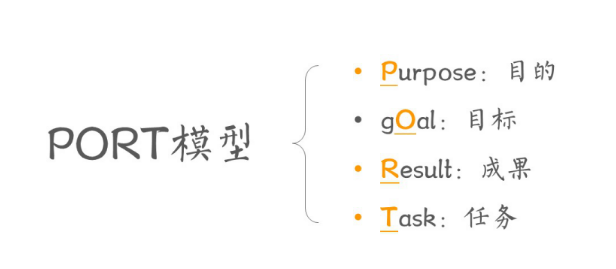

##一、模型呈现

##二、属性
标签：元模型；管理者思维模型
定位：管理者思维的核心模型
重要等级：非常重要

##三、模型认知说明：

### P：Purpose，目的
-Purpose 是什么 / WHAT：
任何一件事拿到手里先思考这件事情的目的是什么。

-为什么要有Purpose / WHY：
当目的明确的时候会呈现出巨大的能量，仿佛拥有了具体的方向，一切行为都要朝向并围绕那个方向前行。

-Purpose 的呈现方式 / HOW：
目的就是我们通常所谓的“为了XXXX”，比如说：“为了人民解放、民族独立”，“为了把这个产品卖到200万”等等。

### O：gOal，目标
-gOal 是什么 / WHAT：
眼睛里可以看到的标准。

-为什么要有gOal / WHY：
目标的确定可以保证事项推进的稳定性。

-gOal 的呈现方式 / HOW ：
- 因为是眼睛看到，说明手够不到，至少说明目标肯定不在舒适区里，没有压力的目标是耍流氓；
- 目标如果要想有效，就得符合SMART原则，其中的R，表示的是和目的相关；
- 目标可以细分为范围、质量、进度、成本四项（RSQC模型）

### R：Result，结果
-Result 是什么 / WHAT：
 目标达成与否的衡量标准。

-为什么要有Result / WHY：
结果导向让目标达成有了方向。

-Result 的呈现方式 / HOW ：
当我们平时做事情之前，可以问问自己，我这次要得到一个什么样的结果，然后奔着这个方向去就好了，基本不会出错的。

### T：Task，任务
-Task 是什么 / WHAT：
任务是用来取得成果的。
   
-为什么要有Task / WHY：
结果导向让目标一步步被达成。

-Task 与目的、目标、结果脱离可能存在的问题 ：
- 做事情的时候是不是总是掉入到细节，还是停下来想想细节背后对应的任务是什么，任务的目的目标是什么？
- 自己制定计划的时候，是先想为什么而做、做成什么标准、得到什么结果，还是直接上来先写任务？
- 在上级安排任务给自己的时候，自己有没有多问一句目的、目标、做成啥结果？还是拼命点头说好好好。
- 事情一多，就在考虑做哪个任务合适啊，而不是考虑这些任务是不是有统一的目的、目标？

##四、使用说明：
####适用场景
 - 主动/被动 做任何一个事情
 - 自检时候使用，避免掉坑

####训练时长
如果每天刻意训练一次，1个月之内就将拥有PORT思维！

####话术：四句咒语+一个固定句
 **四句咒语**
 - 做这件事的目的是什么？还有么？
 - 做这件事的目标是什么？还有么？
 - 做这件事要取得什么成果？还有么？
 - 为了获得这些成果，要做哪些任务？还有么？
 **一个固定句**
 - 光念咒语是不管用的，关键是写下来！

##五、其他
###必要认知：

1. 管理者思维是什么？
    管理者的核心思维是把一切资源都投向到和价值有关的方向来，通过不断把事情做成来实现价值提升的目的。

2. 管理者思维和执行者思维最大的区别是什么？
    管理者注重调配资源，实现目标
    执行者注重解决问题，完成任务

###必要能力：
1.刻意训练意识
2.书写能力

##六、参考资料
[《一个单词让您从执行者成为管理者》](http://www.jianshu.com/p/72cf067228cd)